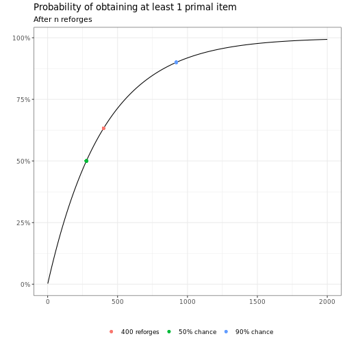
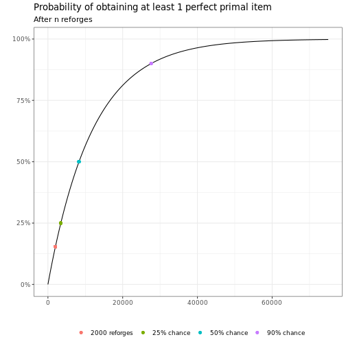
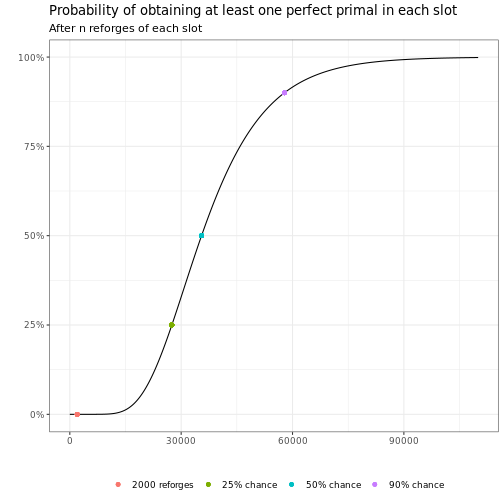

## Introduction
This article explores the probability of having a full set of primal ancient items (primals) in Diablo 3, in order to demonstrate how hard it is to get one. Main motivation comes from a discussion in D3 Switch group, since hacking is sadly very present on consoles, which inflates expectations of new players greatly, and they think they need the best gear ever to push really high.

## Reforge in Diablo 3

### Reforging 1 item

We start with assumption, that there is a 1/400 chance to get a Primal with each reforge.


```{.r .fold-show}
PRIMAL_DROP_RATE = 1/400
```

In order to get the probability of obtaining **at least 1** primal after certain amount of reforges (**n**), we inverse the problem:

* A reforge has a chance to fail of **1 - PRIMAL_DROP_RATE** (or 399/400).
* Therefore, the probability of failing after trying **n** times is (1 - PRIMAL_DROP_RATE) ^ n .
* At the end, the **chance of success** equals to **1 - (chance of fail)**
* This approach is useful, because we want to obtain **at least 1** primal, but there is a chance to obtain any number between **0** and **n** and we have to account for multiples as well.

Our final formula for calculating the chance of getting **at least 1** primal after **n** refoges therefore is


```{.r .fold-show}
prob_primal <- function(n) {
  1-(1-PRIMAL_DROP_RATE)^n
}
```


Now, lets visualize our chances of getting this shiny primal after a few trials


```r
p1_n <- 1:2000
p1_p <- prob_primal(p1_n)
p1_prob <- tibble(n = p1_n, p = p1_p)

p1_min_50 <- firstmin(p1_prob, 0.50)
p1_min_90 <- firstmin(p1_prob, 0.90)

p1_plot <- 
  p1_prob %>% 
  ggplot(aes(x = n, y = p)) + 
  geom_line() +
  geom_point(aes(x = p1_min_50, y = prob_primal(p1_min_50), color = '50% chance')) +
  geom_point(aes(x = 400, y = prob_primal(400), color = '400 reforges')) +
  geom_point(aes(x = p1_min_90, y = prob_primal(p1_min_90), color = '90% chance')) +
  labs(
    title = 'Probability of obtaining at least 1 primal item',
    subtitle = 'After n reforges',
    color = '',
    x = '', y = ''
  ) +
  scale_y_continuous(labels = scales::percent_format(accuracy = 1))

p1_plot
```



Looking at this, we may find that, even after 2000 reforges, 6 out of 1000 people will not get a primal item. After 400 reforges, we have 'only' 63.26% chance to get one - contrary to the popular belief, that if and event has a 1/400 chance of occurring, it must occur once in every 400 trials.


## Reforging 13 items

Diablo allows us to use **13** items at once, but you rarely see seasonal characters have full primal sets - it is very time consuming to get to that point. In this section, we are going to illustrate just how hard it actually is.


Knowing, what a chance of obtaining **at least 1** primal item after a certain amount of reforges is, we can calculate a chance, that you will have obtain **at least 1** primal item for **each slot**, after reforging each of the slots **n** times. (For example, we make 200 gloves, 200 helmets, ... 200 of each of the 13 items we can make)

For this, we just multiply the chance of getting at least one primal with its self 13 times


```r
prob_13_primals <- function(n) {
  prob_primal(n) ^ 13
}
```

This function illustrated, gives us the following curve:


```r
p2_n <- 1:4000
p2_p <- prob_13_primals(p2_n)
p2_prob <- tibble(n = p2_n, p = p2_p)

p2_min_25 <- firstmin(p2_prob, 0.25)
p2_min_50 <- firstmin(p2_prob, 0.50)
p2_min_90 <- firstmin(p2_prob, 0.90)

p2_plot <- 
  p2_prob %>% 
  ggplot(aes(x = n, y = p)) + 
  geom_line() +
  geom_point(aes(x = p2_min_25, y = prob_13_primals(p2_min_25), color = '25% chance')) +
  geom_point(aes(x = 1000, y = prob_13_primals(1000), color = '1000 reforges')) +
  geom_point(aes(x = p2_min_50, y = prob_13_primals(p2_min_50), color = '50% chance')) +
  geom_point(aes(x = p2_min_90, y = prob_13_primals(p2_min_90), color = '90% chance')) +
  labs(
    title = 'Probability of obtaining at least 1 primal item in each slot',
    subtitle = 'After n reforges of every slot',
    color = '',
    x = '', y = ''
  ) +
  scale_y_continuous(labels = scales::percent_format(accuracy = 1)) +
  theme(legend.position = 'bottom')

p2_plot
```


### Individual farming

Again, we can never be 100% sure to achieve our result, but in order to get at least somewhere, we need hundreds of reforges just to get to double-digit probability.

**Conclusion 1: If we decide to reforge every item 1000 times (this means, 13000 reforges in total), we would have only 32.96% chance to get a full primal set.  In order to get to the 90% probability, we would need 1926 reforges on each slot.**

90% is good enough right? Let's see, how many materials do we need. Let's assume we are **split farming** bounties on T16 difficulty, giving us 22 materials per run. Each will consume 5 of each materials. For now, we do not account for forgotten souls needed, and we blindly assume you will be able to get enough of them during your bounty runs (which is a big overstatement) - more on that later.

When it comes to translating number of runs to time, we will assume a very generous 5 minutes / run, and we will also assume you do not have to stop to open your boxes.


```r
# bounty run settings
CACHE_REWARD = 22
REFORGE_CONSUMES = 5
TIME_PER_BOUNTY = 5

# count how many runs we need to get X reforges
count_bounty_runs <- function(reforges) {
  ceiling(reforges * REFORGE_CONSUMES / CACHE_REWARD)
}

# count to hours
bounty_time_h <- function(bounty_runs) {
  bounty_runs * TIME_PER_BOUNTY / 60
}

# count to days
bounty_time_d <- function(bounty_runs) {
  round(bounty_time_h(bounty_runs) / 24, 2)
}
```

This means that we need

```r
bounties_needed = count_bounty_runs(13 * 1926)
bounty_time_hours = bounty_time_h (bounties_needed)
bounty_time_days = bounty_time_d (bounties_needed)
```

5691 bounty runs. And, at 5 minutes a run, not counting any downtimes for actually opening the boxes, this would take us 475 hours, or 19.76 days of uninterrupted game time spent just doing bounties.

### Split bounty farming


```r
# split bounty settings
ind_success <- 0.25
no_players <- 4
group_success <- ind_success ^ no_players
```


This so far, applies to one particular player (although some random people helped with split bounties). But, since split farming is done in 4 man teams, we can content with just a 25.00% chance of success for any particular player, and get roughly 0.39% success rate for this group (same principle as with reforging single items applies here). In order to get here, every player from the group needs to do 916 reforges on every item in every slot.


```r
bounties_needed_4 = count_bounty_runs(13 * p2_min_25)
bounty_time_hours_4 = bounty_time_h (bounties_needed_4)
bounty_time_days_4 = bounty_time_d (bounties_needed_4)
```

** Conclusion 2: A group of 4 players, would need to spend 226 hours doing bounty runs. At the end of this time, the group would have 0.39% chance of at least one of the players getting full primal set. **

This certainly looks possible, but for now, we only took into account *any* primal. Most primal items you get are not perfect, in fact, even if you get the helmet you need, there is a chance the ancient one you already have is better, just because of the primary and secondary stats on it. So let's check how we fare if we take item quality into account.

## Obtaining perfect primals

### Defining a perfect primal
For the sake of simplicity, we will assume that:

* We want to roll a trifecta primal in every item slot. 
* On top of the guaranteed int/dex/str roll, we need to get 2 other suitable **primary** stats
* We do not care about **secondary** stats. 
* With such item, we can either roll off int/str/dex, or add something else to the mix at the mystic. So it is good enough to be considered 'perfect' for this example.
* For **primary** stats, we will only assume a pool of (vit, as, cdr, rcr, cc, cd), meaning that for the example, only 6 posibilities exist. 

This is WAY easier compared to real d3 situation - in 'real world', we would go for quads on jewelry (3 stats + socket), gloves or weapons (we need 3 perfect stats, so we can roll of main stat).  On top of that, many slots have more than dozen of possible stats, like %dmg skill bonuses. We don't even take the existance of all resist(exclusive with secondary resists) or sockets into account. What we calculate, should be still a decent enough illustration - remember, we are very generous in all of our assumption, so the 'real world' situation can only get worse.

### Obtaining at least one perfect primal 


```r
MAIN_STAT_COUNT = 6
p_perf = (1/MAIN_STAT_COUNT) * (1/(MAIN_STAT_COUNT-1))
```

**Conclusion 3: Considering limitations above, the probability of having a 'perfect' primal item is roughly 3.33%. Only 33 out of 1000 primals we get, will have a perfect pool of their mainstats.**

To graph this out, we just use this finding and adjust our success rate, this means multiplying our drop rate by the probability of obtaining a perfect item.


```r
prob_perf_primal <- function(n) {
  1-(1-PRIMAL_DROP_RATE*p_perf)^n
}
```

Subsequently, we can plot this


```r
p3_n <- 1:75000 #seq(from = 0, to = 75000, by = 5)
p3_p <- prob_perf_primal(p3_n)
p3_prob <- tibble(n = p3_n, p = p3_p)

p3_min_25 <- firstmin(p3_prob, 0.25)
p3_min_50 <- firstmin(p3_prob, 0.50)
p3_min_90 <- firstmin(p3_prob, 0.90)

p3_plot <- 
  p3_prob %>% 
  ggplot(aes(x = n, y = p)) + 
  geom_line() +
  geom_point(aes(x = 2000, y = prob_perf_primal(2000), color = '2000 reforges')) +
  geom_point(aes(x = p3_min_25, y = prob_perf_primal(p3_min_25), color = '25% chance')) +
  geom_point(aes(x = p3_min_50, y = prob_perf_primal(p3_min_50), color = '50% chance')) +
  geom_point(aes(x = p3_min_90, y = prob_perf_primal(p3_min_90), color = '90% chance')) +
  labs(
    title = 'Probability of obtaining at least 1 perfect primal item',
    subtitle = 'After n reforges', 
    color = '',
    x = '', y = ''
  ) +
  scale_y_continuous(labels = scales::percent_format(accuracy = 1)) +
  theme(legend.position = 'bottom')

p3_plot
```


Suddenly, our chances do not look that good. 2000 reforges give us only 15.35% chance of getting a perfect primal. And that is just one, let's look at all 13 slots.

### Obtaining 13 perfect primals

Let's define the probability


```r
prob_13_perf_primals <- function(n) {
  prob_perf_primal(n) ^ 13
}
```

And plot it


```r
p4_n <- 1:110000 #seq(from = 0, to = 110000, by = 10)
p4_p <- prob_13_perf_primals(p4_n)
p4_prob <- tibble(n = p4_n, p = p4_p)

p4_min_25 <- firstmin(p4_prob, 0.25)
p4_min_50 <- firstmin(p4_prob, 0.50)
p4_min_90 <- firstmin(p4_prob, 0.90)

p4_plot <- 
  p4_prob %>% 
  ggplot(aes(x = n, y = p)) + 
  geom_line() +
  geom_point(aes(x = 2000, y = prob_13_perf_primals(2000), color = '2000 reforges')) +
  geom_point(aes(x = p4_min_25, y = prob_13_perf_primals(p4_min_25), color = '25% chance')) +
  geom_point(aes(x = p4_min_50, y = prob_13_perf_primals(p4_min_50), color = '50% chance')) +
  geom_point(aes(x = p4_min_90, y = prob_13_perf_primals(p4_min_90), color = '90% chance')) +
  labs(
    title = 'Probability of obtaining at least one perfect primal in each slot',
    subtitle = 'After n reforges of each slot', 
    color = '',
    x = '', y = ''
  ) +
  scale_y_continuous(labels = scales::percent_format(accuracy = 1)) +
  theme(legend.position = 'bottom')

p4_plot
```



Well, now we can see, that if we want a perfect primal, 2000 reforges of each slot get us absolutely nowhere. In order to have at least 25% chance, we would need 27493 reforges of every single slot. And to be 90% sure, it would be an astonishing 57830 reforges on every single item!

Let's go back to our 4-man farming dream team. 


```r
final_bounties_needed <- count_bounty_runs(13 * p4_min_25)
final_bounty_time_hours <- bounty_time_h (final_bounties_needed)
final_bounty_time_days <- bounty_time_d (final_bounties_needed)
```

**In order to have roughly 99.61% chance of at least 1 party member obtaining a full primal set, each team member would have to reforge every item 27493 times. For this, each team member would need to do 81230 bounty runs, which translates to 6769 hours of pure farming with 0 downtimes. Keep in mind, that this represents roughly 282 days, but one season usually lasts anywhere from 90 to 120 days. **

So, next time you see someone 'maybe legit', running around with a set of perfectly rolled primals by the end of the season, ask yourself, if he is one of the four people that spent entire season and then some bounty farming, or if they cheated their way in. (Also keep in mind, we are super generous in every aspect.)

## Bonus fun fact - Forgotten Souls

You also need souls to reforge, at 50 pieces a pop. 


```r
SOULS_PER_REFORGE <- 50
souls_per_run <- CACHE_REWARD/REFORGE_CONSUMES * SOULS_PER_REFORGE
souls_total <- ceiling(count_bounty_runs(13 * p4_min_25) * souls_per_run)
hours_mashing <- round(souls_total / 3600 / 2)
```


So, while the caches from a bounty run will give us 4.4 reforges, we also need to get 220 souls per run, or 17870601 souls in total. Even if we assume, that we magically get all the souls during the bounty runs, and at the same time we assume it takes you only half a second to salvage each of the souls (because console animations rock XD), we would need to spend just 2482 **hours** mashing the A button at blacksmith to have our 25% shot at getting a full perfect primal set. Still not convinced? :)


